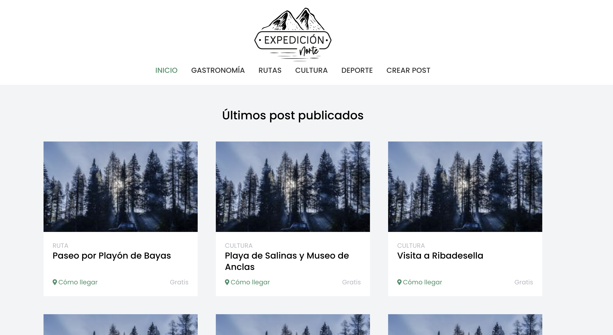

# Expedición Norte
#### This project was born from the need to group and share all those experiences and activities that can be carried out in Asturias so that other people can be inspired when it comes to getting to know this area.

## Table of contents
* [Preview](#preview)
* [Building](#building)
* [Technologies](#technologies)

## Preview



## Building

### Requirements

_Install NodeJS and npm. You can download the installer from the following link: https://nodejs.org/es/download/_

### Installation

#### BACKEND
_Follow the README instructions of the backend repo: https://github.com/lele589/blog-backend_

#### FRONTEND
_Clone a copy of the repo:_

```
git@github.com:lele589/expedicion-norte.git
```
_Change to the new directory:_

```
cd expedicion-norte
```
_Install dependencies:_

```
npm ci
```

_Launch the project:_

```
npm start
```

## Technologies
Project is created with:
* [React](https://es.reactjs.org/) - Version 17.0.2
* [Typescript](https://www.typescriptlang.org/) - Version 4.2.4
* [React Redux](https://react-redux.js.org/) - Version 7.2.4
* [React Router](https://reactrouter.com/web/guides/quick-start) - Version 5.2.0
* [Styled Components](https://styled-components.com/) - Version 5.2.3
* [npm](https://docs.npmjs.com/) - Version 7.6.1